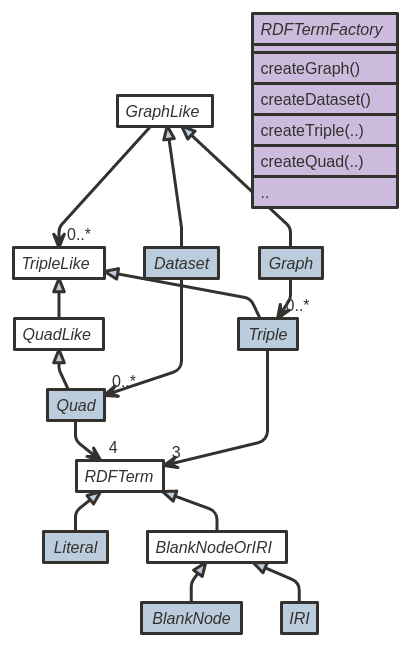

# Apache Commons RDF

[](https://travis-ci.org/apache/commons-rdf)

[](https://coveralls.io/github/apache/commons-rdf?branch=master)

[Commons RDF](https://commons.apache.org/proper/commons-rdf/) aims to provide a common
library for [RDF 1.1](http://www.w3.org/TR/rdf11-concepts/) with implementations
for common Java RDF frameworks like [RDF4J](http://rdf4j.org/), [Apache
Jena](http://jena.apache.org/) as well as for other libraries such as
[OWLAPI](http://owlapi.sourceforge.net/),
[Clerezza](http://clerezza.apache.org/) and other JVM languages.

The main motivation behind this simple library is to revise an historical
incompatibility issue between these toolkits. This library does not pretend to
be a generic API wrapping those libraries, but is a 
[set of common Java interfaces](https://commons.apache.org/proper/commons-rdf/apidocs/index.html?org/apache/commons/rdf/api/package-summary.html)
for the RDF 1.1 concepts, e.g. `IRI`, `BlankNode`, `Graph`,
accompanied with unit test cases for their expected behavior, and a `simple`
implementation, which main purpose is to clarify the tests and interfaces.

In particular, Commons RDF aims to provide a type-safe, non-general API that
covers RDF 1.1. 

A diagram of the interfaces included in Commons RDF:

<a href="src/site/resources/images/class-diagram.png"></a>


Everybody is welcomed to join the project and
[contribute](https://commons.apache.org/proper/commons-rdf/contributing.html)!

See the [Commons RDF homepage](httasp://commons.apache.org/proper/commons-rdf/) for more details.

## License


Licensed to the Apache Software Foundation (ASF) under one
or more contributor license agreements. See the [NOTICE](NOTICE) file
distributed with this work for additional information
regarding copyright ownership. The ASF licenses this file
to you under the Apache License, Version 2.0 (the
"License"); you may not use this file except in compliance
with the License.  You may obtain a copy of the License at

http://www.apache.org/licenses/LICENSE-2.0

Unless required by applicable law or agreed to in writing, software
distributed under the License is distributed on an "AS IS" BASIS,
WITHOUT WARRANTIES OR CONDITIONS OF ANY KIND, either express or implied.
See the License for the specific language governing permissions and
limitations under the License.


## Contributing

Feel free to subscribe to the 
[dev@commons](https://lists.apache.org/list.html?dev@commons.apache.org)
mailing list, use the 
[Subject tag `[RDF]`](https://lists.apache.org/list.html?dev@commons.apache.org:lte=1M:%5BRDF%5D)
to follow the ongoing development of Commons RDF, ask questions 
about its usage, or help shape Commons RDF by 
[contributing](https://commons.apache.org/proper/commons-rdf/contributing.html)
your ideas, code and use cases. 
 


## Building

Building has been tested with [Apache Maven 3.2](http://maven.apache.org/download.cgi) and [Java JDK 8](http://www.oracle.com/technetwork/java/javase/downloads/).

    $ mvn clean install
    [INFO] Scanning for projects...
    [INFO] ------------------------------------------------------------------------
    [INFO] Reactor Build Order:
    [INFO] 
    [INFO] Commons RDF
    [INFO] Commons RDF: API
    [INFO] Commons RDF: Simple impl
    [INFO] 
    [INFO] Using the builder org.apache.maven.lifecycle.internal.builder.singlethreaded.SingleThreadedBuilder with a thread count of 1
    [INFO]                                                                         
    [INFO] ------------------------------------------------------------------------
    [INFO] Building Commons RDF 0.5.0
        ....
    [INFO] Installing /home/johndoe/src/commons-rdf/commons-rdf-api/target/commons-rdf-api-0.5.0-javadoc.jar to /home/johndoe/.m2/repository/org/apache/commons/commons-rdf/commons-rdf-api/0.5.0/commons-rdf-api-0.5.0-javadoc.jar
    [INFO] ------------------------------------------------------------------------
    [INFO] Reactor Summary:
    [INFO] 
    [INFO] Commons RDF ........................................ SUCCESS [  0.404 s]
    [INFO] Commons RDF: API ................................... SUCCESS [  0.031 s]
    [INFO] Commons RDF: Simple Implementation ................. SUCCESS [  0.010 s]
    [INFO] Commons RDF: Integration: RDF4j .................... SUCCESS [  0.012 s]
    [INFO] Commons RDF: Integration: Apache Jena .............. SUCCESS [  0.011 s]
    [INFO] Commons RDF: Integration: JSON-LD Java ............. SUCCESS [  0.009 s]
    [INFO] Commons RDF: Integration tests ..................... SUCCESS [  0.005 s]
    [INFO] ------------------------------------------------------------------------
    [INFO] BUILD SUCCESS
    [INFO] ------------------------------------------------------------------------
    [INFO] Total time: 7.718 s
    [INFO] Finished at: 2015-01-26T02:09:10+00:00
    [INFO] Final Memory: 22M/309M
    [INFO] ------------------------------------------------------------------------


To then use this build from your project, add to Maven (update `<version>` to match the Maven output):

    <dependency>
        <groupId>org.apache.commons</groupId>
        <artifactId>commons-rdf-api</artifactId>
        <version>0.5.0</version>
    </dependency>

.. and an equivalent `<dependency>` for the 
[implementation](https://commons.apache.org/proper/commons-rdf/implementations.html)
you would like, e.g. `commons-rdf-simple`.

The `<version>` above might not be up to date, 
see the [downloads](https://commons.apache.org/proper/commons-rdf/download.html) to
use the latest stable release published in Maven Central.
    

## Snapshot repository

The Apache Commons RDF project is aiming to regularly release early 
previews releases (0.x.y versions) and publish these to Maven Central.
See the [downloads](https://commons.apache.org/proper/commons-rdf/download.html) to 
use the latest stable release.


However, if you are following the ongoing
development on [dev@commons](https://lists.apache.org/list.html?dev@commons.apache.org), (using subject tag `[RDF]`)
you may want to try the [snapshot builds](https://builds.apache.org/job/commons-rdf/), 
which are automatically deployed to the 
[Apache snapshot repository](https://repository.apache.org/content/groups/snapshots/org/apache/commons/commons-rdf-api/).

To use these snapshots from your Maven project, depend on the latest `*-SNAPSHOT` version
as found in the current [pom.xml](pom.xml), and add to your own `pom.xml`:

```xml
<repositories>
  <repository>
    <id>apache.snapshots</id>
    <name>Apache Snapshot Repository</name>
    <url>http://repository.apache.org/snapshots</url>
    <releases>
      <enabled>false</enabled>
    </releases>
  </repository>
</repositories>
```


## Simple implementation

The [commons-rdf-simple](simple) module contains a 
simple (if not naive) implementation of the Commons RDF API 
using in-memory POJO objects.

Note that although this module fully implements the commons-rdf API,
it should *not*  be considered a reference implementation. 
It is not thread-safe nor scalable, but may be useful for testing
and simple usage (e.g. output from an independent RDF parser).

## Testing

The abstract classes
[AbstractGraphTest](commons-rdf-api/src/test/java/org/apache/commons/rdf/api/AbstractGraphTest.java),
[AbstractDatasetTest](commons-rdf-api/src/test/java/org/apache/commons/rdf/api/AbstractDatasetTest.java),
[AbstractBlankNodeTest](commons-rdf-api/src/test/java/org/apache/commons/rdf/api/AbstractBlankNodeTest.java) and
[AbstractRDFTest](api/src/test/java/org/apache/commons/rdf/api/AbstractRDFTest.java)
can be realised as JUnit tests by implementations in order to verify that they
pass the minimal requirements of this API.

In order for this to work, your project will need to depend on the `tests`
classifier for the commons-rdf-api module, for example (for Maven):

    <dependency>
        <groupId>junit</groupId>
        <artifactId>junit</artifactId>
        <version>4.12</version>
        <scope>test</scope>
    </dependency>
    <dependency>
        <groupId>org.apache.commons</groupId>
        <artifactId>commons-rdf-api</artifactId>
        <version>0.5.0</version>
        <classifier>tests</classifier>
        <scope>test</scope>
    </dependency>

The extensions of each Test class need to provide a 
[RDF](api/src/main/java/org/apache/commons/rdf/api/RDF.java) instance
that can create the corresponding implementations of a `Graph`, `IRI`, etc.

For an example, see 
[SimpleGraphTest](commons-rdf-simple/src/test/java/org/apache/commons/rdf/simple/SimpleGraphTest.java).


