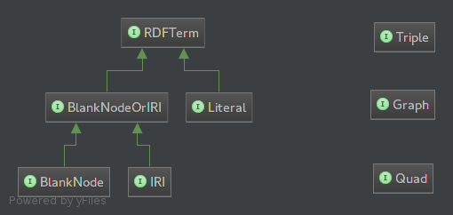

# Commons RDF

Working repository for experimenting with idea of providing a common library for [RDF 1.1](http://www.w3.org/TR/rdf11-concepts/) that could be implemented by the upcoming versions of the main Java toolkits ([Jena](http://jena.apache.org) 3.0 and [Sesame](http://openrdf.callimachus.net) 4.0) as well as wrappers for other JVM languages ([Banana RDF](https://github.com/w3c/banana-rdf) and so on).

The main motivation behind this simple library is revise an historical incompatibility issue. This library does not pretend to be a generic api wrapping those libraries, but a set of interfaces for the RDF 1.1 concepts that can be used to expose common RDF-1.1 concepts using common Java interfaces. In the initial phase commons-rdf is focused on a subset of the core concepts defined by RDF-1.1 (URI/IRI, Blank Node, Literal, Triple, and Graph). In particular, commons RDF aims to provide a type-safe, non-general API that covers RDF 1.1. In a future phase we may define interfaces for Datasets and Quads.

## Status

This library is still work in progress. At some point we'll thing about moving to a recognizable organization, Apache or whatever.

A draft diagram of the interfaces which may be included in Commons RDF are:

## Contributors

* Sergio Fernández ([Apache Marmotta](http://marmotta.apache.org))
* Andy Seaborne ([Apache Jena](http://jena.apache.org))
* Peter Ansell ([OpenRDF Sesame](http://openrdf.callimachus.net))
* Alexandre Bertails ([W3C](http://www.w3.org))

## License

[Apache License, Version 2.0](http://www.apache.org/licenses/LICENSE-2.0.html)
